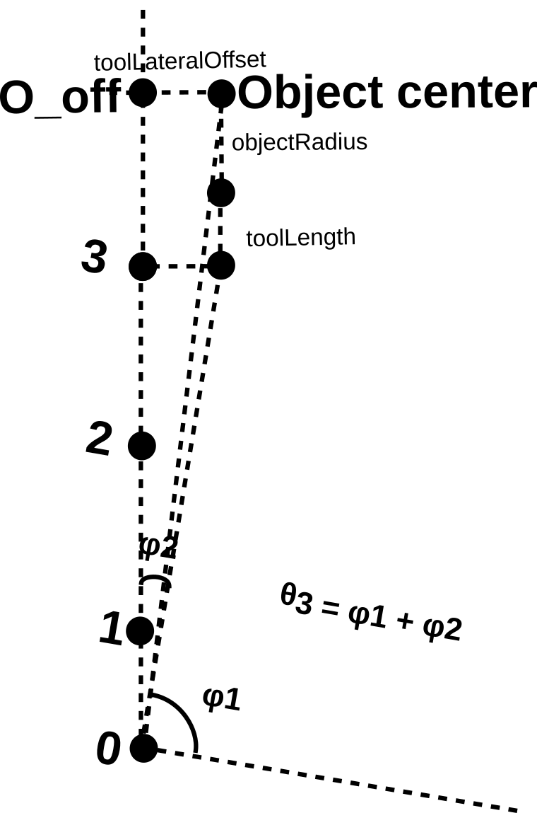
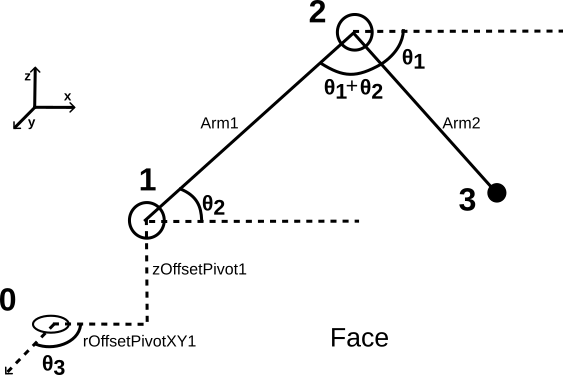

# Justification des calculs de cinématique

    
Ce document a pour objectif de préciser les calculs cinématiques effectués afin de convertir une position en une commande angulaire. Elle est dépendante de la configuration physique du système, ainsi que de l'objet à préhenser.

  

Le défi de cette conversion est de passer des coordonnées cartésiennes aux coordonnées cylindriques, qui permettront de simplifier les caluls par la suite et de limiter les erreurs logiques. 
Nous allons dans un premier temps travailler sur le plan horizontal XY, afin de retrouver les coordonnées du bout du bras (wristEnd, ou pivot 3).   

## Travail sur le repère XY

  

  

On remonte la cinématique du système, partant des coordonnées (x, y) du centre du préhenseur au pivot 3.   

- $r04XY = \sqrt{x²+y²}$,

où r04XY est le rayon entre le point 0 (origine du repère et centre du servo Z) et le centre du préhenseur 4, projeté sur le plan XY.   

- $r04OffXY = \sqrt{r04XY²-toolLateralOffset²}$,

où r04OffXY est le rayon entre le point 0 et le point 4Off, projection du point 4 sur l'axe du bras; le bras n'est pas aligné avec le sens du préhenseur, on induit donc un décalage (offset) perpendiculaire au rayon formé par le bras.   

- $r03XY = r04OffXY - toolLength + rayonObjet$,

où r03XY est le rayon entre le pivot 0 et le pivot 3 (pivot à l'extrémité du bras), toolLength la longueur entre le pivot 3 et le centre du préhenseur.   

- $z03 = z - toolHeight$, 

où z03 est la hauteur entre le pivot 0 et le pivot 3, toolHeight la hauteur du préhenseur, c'est-àdire la hauteur entre le pivot 3 et le centre du préhenseur.   

On voit ici l'intérêt de passer en coordonnées cylindriques : on a juste à soustraire des longueurs, peu importe la position angulaire du servo Z. On peut se le permettre car ces points sont invariants entre eux sur l'axe z (altitude) et sur l'axe r (vecteur directeur du repère cylindrique).

## Travail dans le repère cylindrique

Le passage en coordonnées cylindrique continue d'ếtre avantageux lors du calcul des différentes positions des points du bras du système (constitué du bras 1 - Arm1, et du bras 2 - Arm 2) : il permet de travailler sur un plan, plutôt que dans l'espace. Cette fois-ci, on travaille non seulement sur le plan XY via l'axe $\vec{r}$, mais aussi sur l'axe $\vec{z}$; la position des servos modifient le rayon 03 sur XY, mais aussi la hauteur des points 2 et 3. Un plan peut être formé à partir de l'axe de rayon $\vec{r}$ et de $\vec{z}$ : nous appelerons ce nouveau plan de travail le plan RZ.   
Nous appliquerons ici une méthode similaire à celle employée dans le plan XY : partir des positions cylindriques des points connus pour remonter à celle des points inconnus.

  

  

On connait la position dans le repère cylindrique du pivot 3. On déduit la position du point 1 à partir des données physiques du robot, puis celle du point 2 en utilisant le théorème d'Al-Kashi dans le repère RZ.   

- $r01 = \sqrt{offsetPivot1XY² + offsetPivotZ²}$,

où r01 est le rayon dans l'espace entre le point 0 et le point 1, offsetPivot1XY et offsetPivotZ les décalages constants dans RZ du point 1 par rapport au point 0, respectivement selon $\vec{r}$ et $\vec{z}$; ces deux distances sont définies par les propriétés physiques du robot.  

Naturellement, $z01 = offsetPivotZ$, où z01 est la hauteur entre le point 0 (origine) et 1. On peut maintenant appliquer le théorème.   

- $d13XY = r03XY-offsetPivot1XY$,

où d13XY est la distance entre les projections des points 1 et 3 sur le plan XY.   

- $d13 = \sqrt{d13XY²+(z03-offsetPivot1XY)²}$,

où d13 est la distance dans l'espace entres les points 1 et 3. C'est à partir de ce segment et des 2 bras qu'on va appliquer le théorème d'Al-Kashi.  
On rappelle que le théorème d'Al-Kashi s'exprime de la manière suivante : $a²=b²+c²-2bccos(\alpha)$; on a dans notre cas a le bras 2 (Arm 2), b le bras 2 (Arm 1) et c le segment 13. \alpha est l'angle formé par le segment 13 et le bras 1.'   

- $angle13Bras1 = \arccos{(lBras1²+d13²- \frac{lBras2²}{2 \times lBras1 \times d13})}$,

où angle13Bras1 est l'angle formé par le segment 13 (point 1 à 3) et le bras 1, lBras1 la longueur du bras 1 (constante), et lBras2 la longueur du bras 2 (constante)   

- $angleHorizontal13 = \arctan{(\frac{z03-offsetPivotZ}{d13})}$,

où angleHorizontal13 est l'angle formé entre le segment 13 et le projeté de ce segment sur le plan XY (plan horizontal)   

- $angleHorizontalBras1 = angleHorizontal13+angle13Bras1$

où angleHorizontalBras1 est l'angle formé entre le bras 1 et le projeté de ce segment sur le plan XY   

- $z02 = \sin{(angleHorizontalBras1)}\times lBras1 + z01$

où z02 est l'altitude du point 2 par rapport à l'origine.   

- $r02XY = offsetPivot1XY + \cos{(angleHorizontalBras1)}\times lBras1$

où r02XY est le rayon entre le point 0 et le point 2 sur le repère XY.   

- $r02 = \sqrt{z02²+r02XY²}$

où r02 est le rayon entre le point 0 et le point 2 dans l'espace.   

## Détermination des angles géométriques et des angles de commande des servos

### Calcul des angles géométriques

On a maintenant toutes les positions des points dans le repère cylindrique. On peut en déduire les angles géométriques $\theta 1$, $\theta 2$, $\theta 3$, $\phi 1$ and $\phi 2$ (voir schémas précédents).

- $\theta 1 = \arctan{(\frac{z03-z02}{r03XY-r02XY})}$  , cet angle est toujours négatif ou nul.

- $\theta 2 = angleHorizontalBras1$   

- $\phi1 = \arctan{(\frac{y}{x})}$, angle formé par l'axe $\vec{x}$ et rayonObjet.  

- $\phi2 = \arctan{(\frac{toolLateralOffset}{r04OffXY})}$, angle induit par le décalage du préhenseur par rapport au bras   

- $\theta 3 = \phi1 + \phi2$  

### Angles de commande des servos

A partir de ces angles géométriques, nous pouvons obtenir les angles de commande à fournir aux servos (en considérant que ces servos sont des actionneurs parfaits).

- $angleCommandeServoGauche = 180 + \theta 1$  
- $angleCommandeServoDroite = 180 - \theta 2$  
- $angleCommandeServoCentral = \theta 3$  
